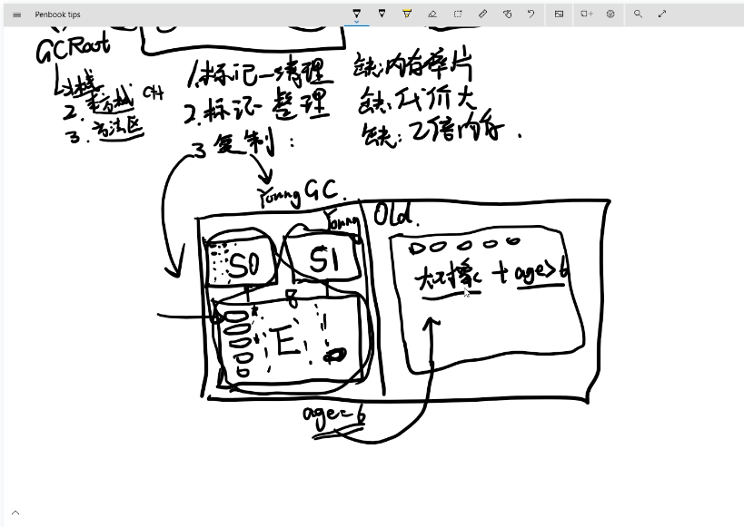

# GC简介
## context：
GC (garbage collection)
GCroot可达性分析
1. 标记清理算法 (Mark-Sweep)
collector从引用根结点开始遍历, 标记所有被引用的对象。 在对象的header中记录为可达对象。
collector从堆内存从头到尾进行线性的遍历，如果发现对象的header中没有标记为可达对象，则将其回收。

缺点： 
效率不高
会产生内存碎片
gc会使得整个应用停止

3. 标记整理算法 (Mark-compact)
缺点：代价大

4. 复制算法 (Copying)
缺点：需要两倍内存

大对象 (大对象)
老年代 full gc 伴随young gc.
年轻代的垃圾收集器 ParNew
老年代的垃圾收集器 cms
g1 垃圾收集器
