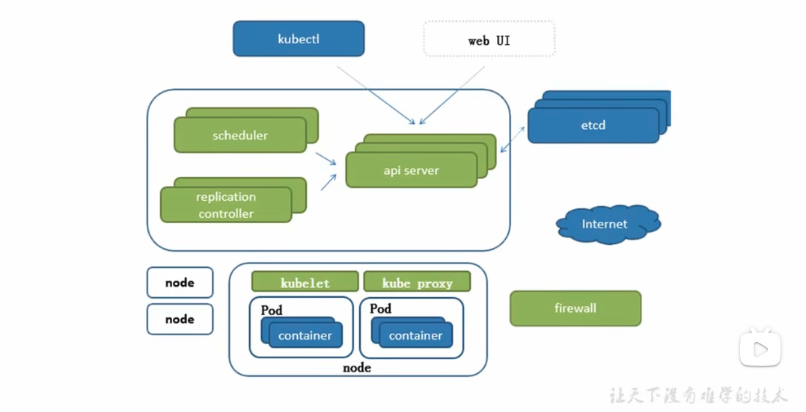

Infrastructure as a service: cloud
platform as a service: Docker
software as a service: application

相比较传统的集群
每个单独的服务器上都需要配置容器
容器的集群化成为新的需求
资源管理器：
apache mesos：开源分布式的资源管理框架 2019-05 tweet -> k8s
docker swarm: 轻量级 2019-07 
k8s: google 容器化基础架构 go语言 borg翻写
特点：
轻量级：消耗的资源小
开源
弹性伸缩
负载均衡：IPVS

组件说明：
pod：最小的封装集合，一个pod中会封装多个容器。构成一个子节点的运行环境。
是k8s中管理的最小单位。
控制器类型 
网络通讯模式
构建一个k8s集群
资源清单：资源 掌握资源清单的语法 编写pod 掌握pod的生命周期
pod控制器 掌握各种控制器的特点和使用定义方式

通过服务发现 service 将pod暴露给客户端 round-robin轮训算法暴露

存储：掌握多种存储类型的特点 并在不同环境中选择合适的存储方案
服务的分类
有状态服务：DBMS(database management system)
无状态服务：LVS apache

调度器： 将pod放到指定的节点
掌握调度器远离 能够把pod定义到想要的节点运行

集群安全：集群的认证 鉴权 访问控制 原理及其流程

HELM： linux系统中的yum 掌握HELM的原理 helm模版自定义 helm部署一些常用的插件或附件
 
运维：
kubeadm源码修改 达到证书可用期限为10年 
k8s 能够构建高可用的k8s集群

API server：所有服务访问统一入口
